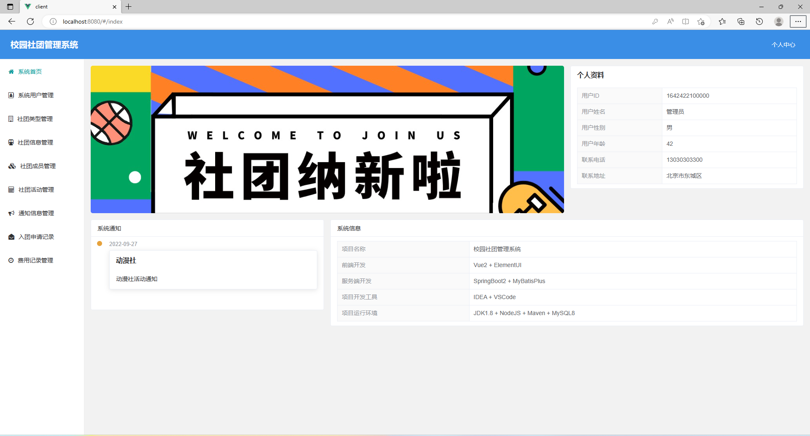
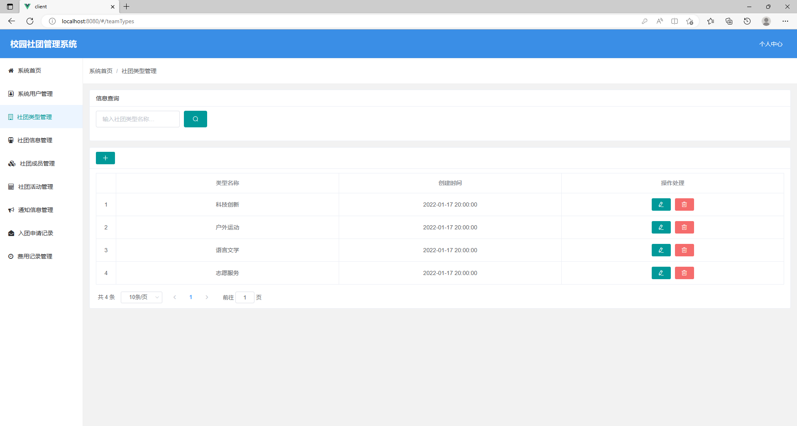
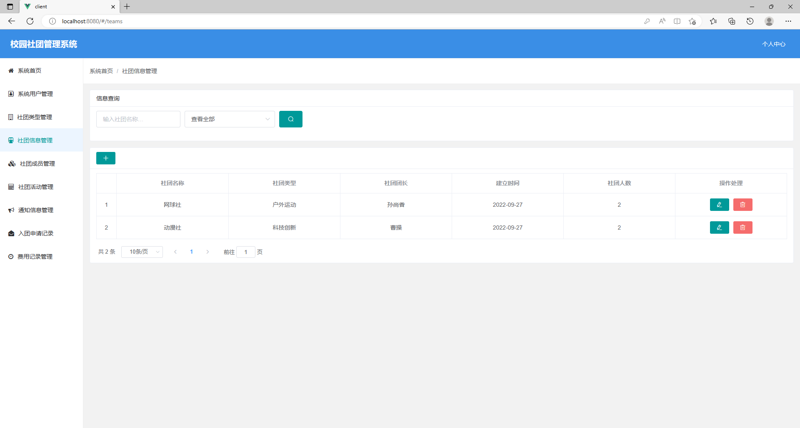
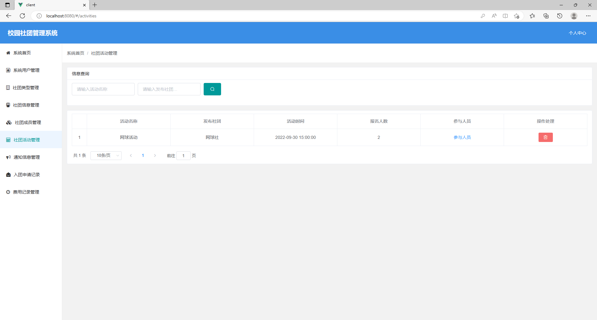
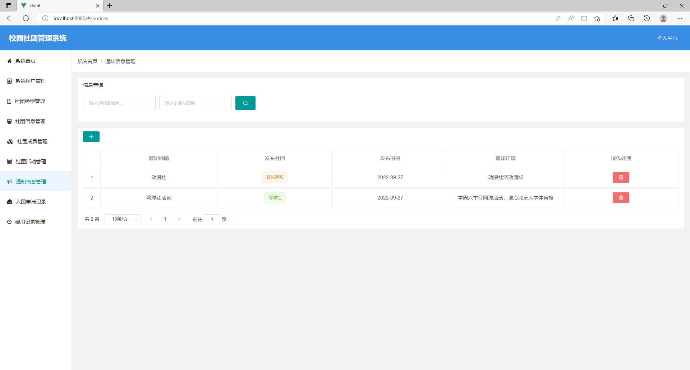
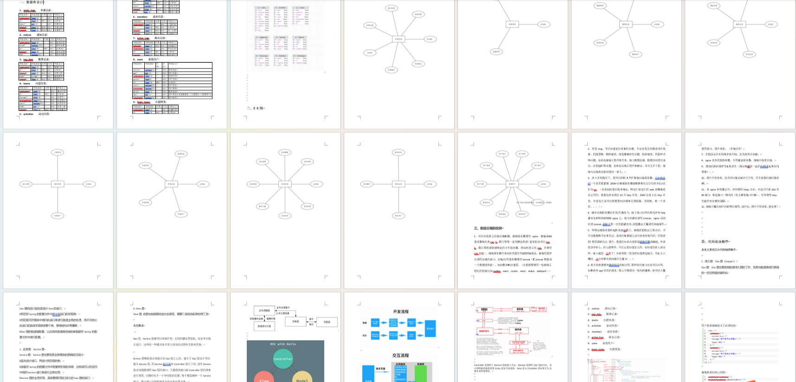

# 社团管理系统带项目文档

## 一、项目介绍

数据库:mysql

开发语言：java

基于springboot+vue 的校园互助管理系统

基于springboot+vue的前后端分离社团管理系统

前端开发 : Vue2 + ElementUl

后端开发 : SpringBoot2 + MyBatisPlus

数据库 ：MySQL

设计思路

权限设计：系统管理员 社团管理员 普通用户

系统管理员：管理系统所有模块所有用户的，系统默认设置一个
社团团长：社团的负责人管理社团相关工作
普通用户： 我们个人可以申请账户，申请加入社团，看到社团相关信息

模块设计：

一、系统管理员：系统首页+系统用户管理+社团类型管理+社团信息管理+社团成员管理+社团活动管理+通知信息管理+入团申请记录+费用申请记录 9个模块

二、社团团长：系统首页+社团信息浏览+社团成员管理+入团申请记录+社团活动浏览+通知信息管理+费用申请记录 7个模块

三、普通用户： 系统首页+社团信息浏览+入团申请记录+社团活动浏览+费用申请记录 5个模块

用户身份users表
(0系统管理员，1社团团长，2普通用户)

[系统设计逻辑讲解]

系统管理员账户是初始化数据;
系统登录界面可以注册，注册完成后为普通用户，系统管理员可以管理系统所有模块;
社团团长功能介绍：如张三首次注册是普通用户，如果张三被设置为社团团长后，张三的系统身份会自动变为社团团长，社团团长有且只能加入管理此一个社团;社团团长可以管理自己负责社团信息；
普通用户功能介绍：如王五首次注册是普通用户，王五作为普通用户可以加入多个社团，可以看的多个社团的相关信息活动信息等
总结：首次注册均为普通用户，系统管理员设置某个用户为社团团长后，对应用户权限会更新，可以管理自己负责社团;

### 完整项目获取

通过网盘分享的文件：社团管理系统

链接: https://pan.baidu.com/s/1OCHTZOkhHRqH8qBLjxMZeg?pwd=t5wh 提取码: t5wh
--来自百度网盘超级会员v3的分享

通过网盘分享的文件：工具包

链接: https://pan.baidu.com/s/1YmdoJvkjoUjA75wvHLDZ6A?pwd=xm96 提取码: xm96
--来自百度网盘超级会员v3的分享

通过网盘分享的文件：远程调试部署联系方式

链接: https://pan.baidu.com/s/1W0dDcoZmayG0c7USJDYBYg?pwd=nqd7 提取码: nqd7
--来自百度网盘超级会员v3的分享

### 项目合集(项目不断更新中)
链接: https://pan.baidu.com/s/1nY-zhvAK0CXYcn3g7LzQnQ?pwd=id3c 提取码: id3c
--来自百度网盘超级会员v3的分享

#### 这些项目一起发你了 可以分享给你需要的同学 调试可找我 也接二次修改和项目定制、毕业设计等

## 接毕业设计和论文

微信联系方式：xzxj0206  QQ：3808981644   (支持修改、 部署调试、 支持代做毕设)

接网站建设、小程序、H5、APP、各种系统等，单片机、嵌入式也可以做

选题+开题报告+任务书+程序定制+安装调试+论文+答辩ppt  都可以做

## 二、系统运行界面展示

### 部分功能界面截图

### 6000字项目文档参考

